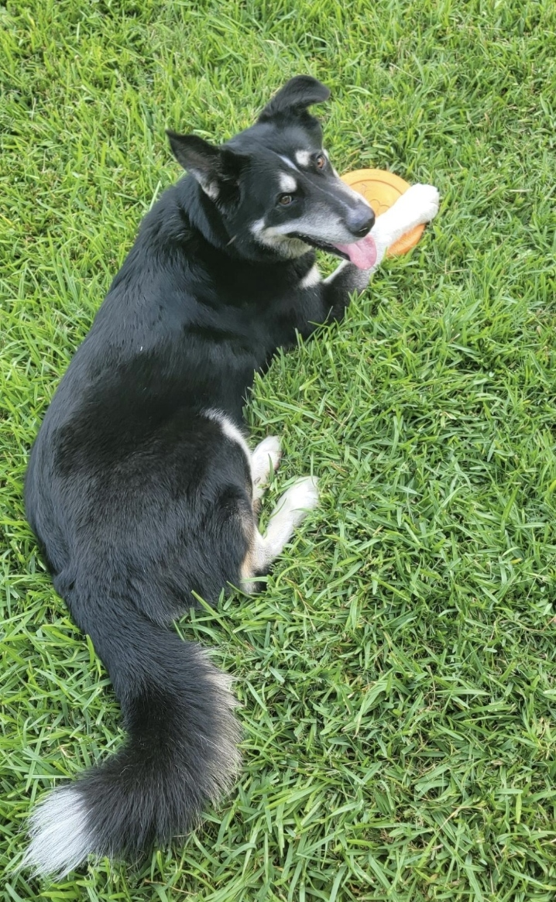

<!-- # Template Portfolio
This will be your portfolio repository. Use this as a [template repository](https://docs.github.com/en/repositories/creating-and-managing-repositories/creating-a-template-repository) and customize it to your own tastes. We gave you a starting point with a space to describe yourself and a link to where your assignment 1 file can be.

# About Me
*My name is Amber Horvath, I'm a postdoctoral associate researching code comprehension interventions, it's nice to meet you! [Here is a link to my real website.](https://amberhorvath.com)
Now you should write something about yourself here!*

Some fun facts about me:
1. I love hockey.
2. I do pottery.
3. I have an extra bone in my right foot.

 -->

# 6.1040 Portfolio

## About Me
*My name is Ryan Stam, I'm a 4th year student at MIT majoring in 6-3 (CS and Engineering), it's nice to meet you!*

Some of my goals for the semester:
1. Gain more experience with creating full, E2E apps
2. Learn about design principles for software
3. Gain skills for team-based software development

Some fun facts about me: 
1. I've spun fire poi with the MIT Spinning Arts club
2. I'm a tour guide for MIT Admissions
3. I have a dog named Niko

# Table of Contents
[Link to Assignment 1](assignments/assignment1/assignment1.md)
