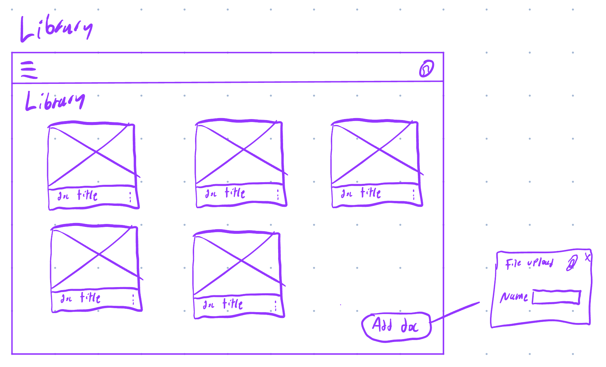
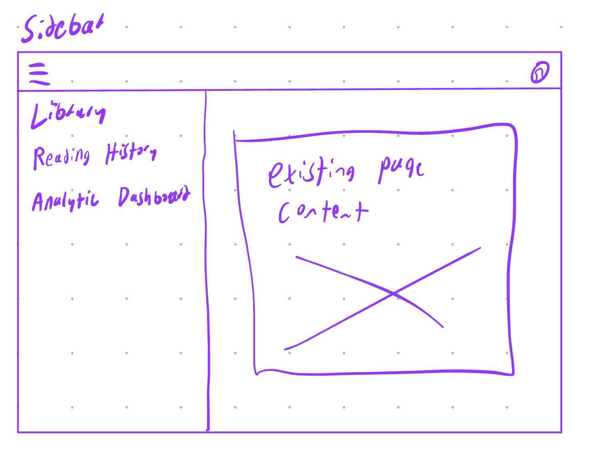
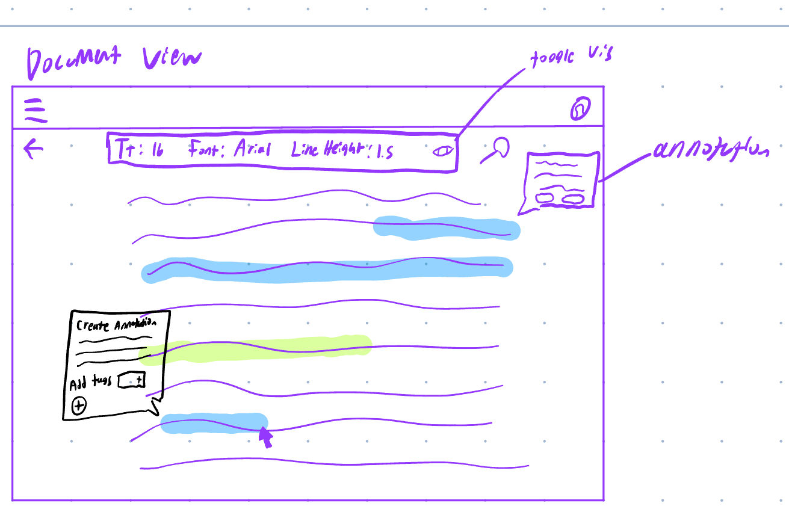
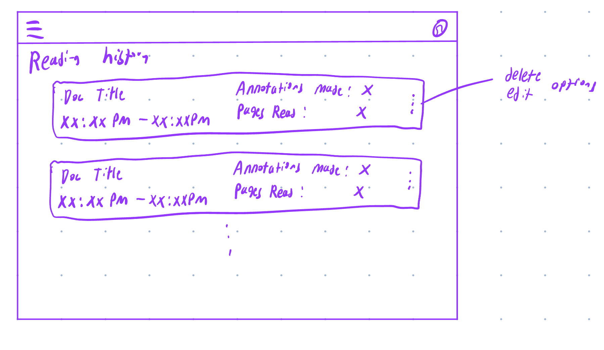
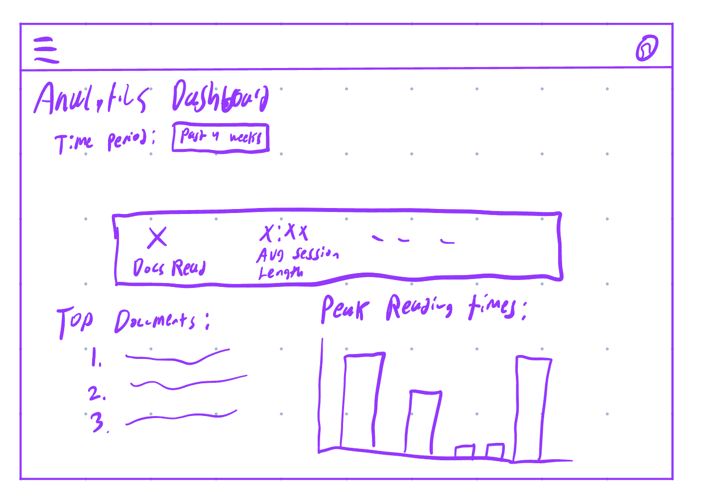

# Task 4 - UI Sketches

### Library/Homepage

Users' library is their homepage, and can add and view their documents from this page. They can also click on the 3 dots on each document to edit the name or delete the document. 

### Sidebar

Clicking on the sidebar button (the hamburger menu icon/3 horizontal lines) allows the users to navigate to the various pages. ("Existing page content" just refers to the content that is already being displayed when the sidebar is clicked).

### Reading a Document

This shows a rough sketch of the document view. The first (blue) highlight shows an example existing annotation, the green highlight shows a highlight-only annotation, and the third (blue) highlight shows an annotation being made. A small menu pops up, where the user can write annotation text (or leave blank for a highlight-only annotaiton) and can add tags. 

### Viewing Reading History

Users can look at the history of documents they've read, showing the start/end times, how many pages they read, and how many annotations they made. Users can also manually edit or delete the session data.

### Viewing Analytics

This is a rough sketch of a potential viewing analytics page. At the top, the user can set the time period for the analytics. There will be an executive summary box which shows how many documents read, average session length, and other info (like number of sessions, total time reading, etc). Beneath are additional metrics, like the top documents by time spent, peak reading times, etc. 
