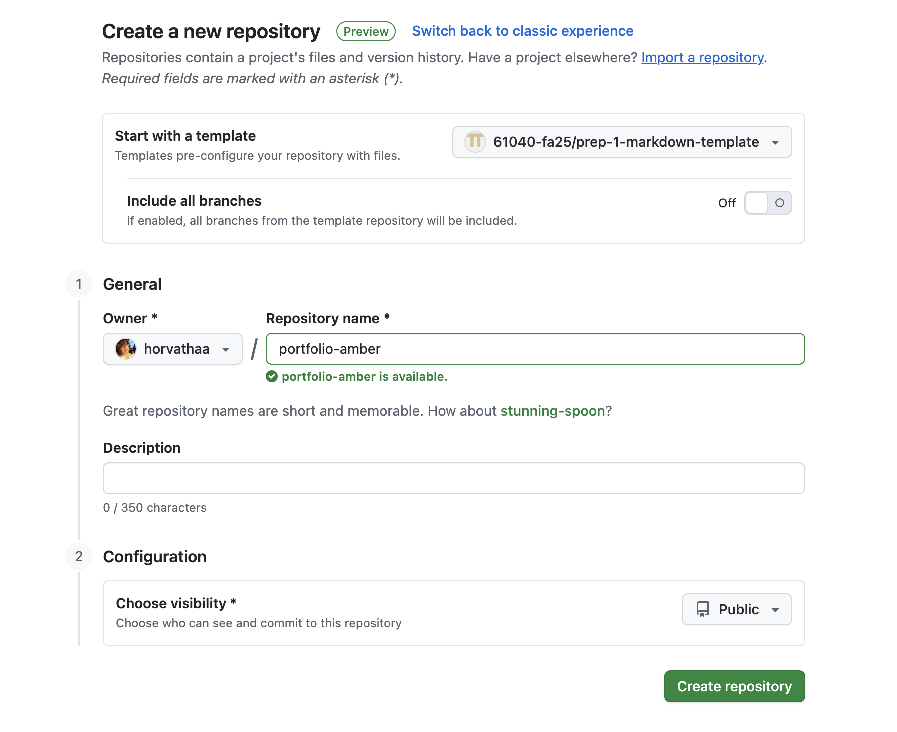

# H1
## H2
### H3

**bold**

*italics* 

> Blockquote

Code: `My variable`

Code block: 
```
def foo():
    return bar;
```

1. List 1
2. List 2
3. List 3

- bullet 1
- bullet 2
- bullet 3

[text to be linked](https://www.google.com)

# Table of Contents
[Assignment 1](assignments/assignment1.md)

[go back to heading 1](#h1)




| Column 1 | Column 2 | Column 3 |
|----------|----------|----------|
| Demo A   | Demo B   | Demo C   |